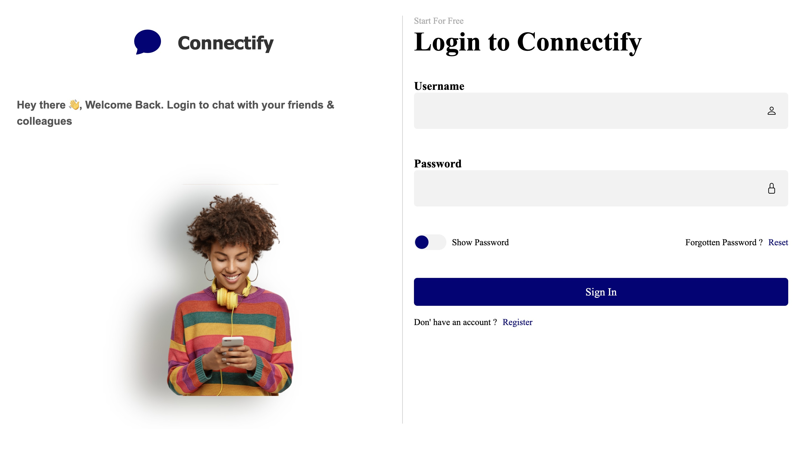
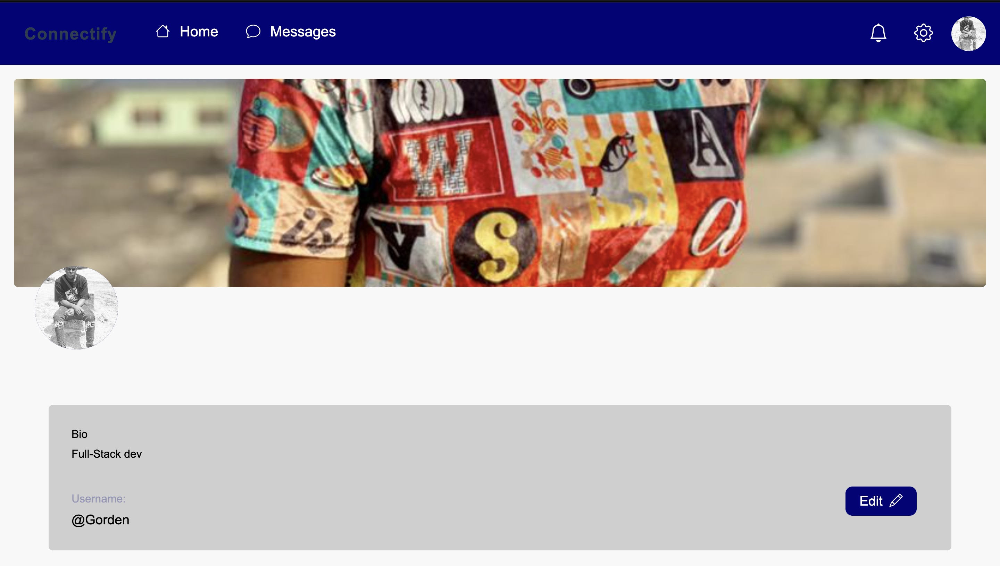
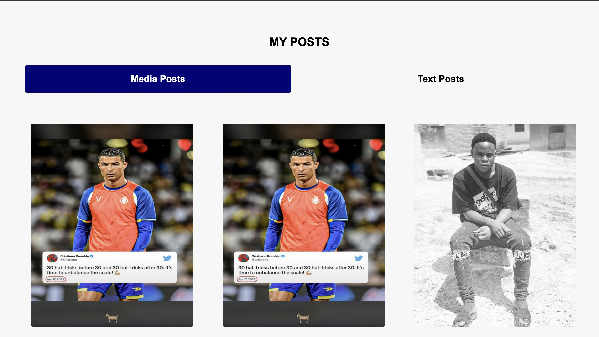
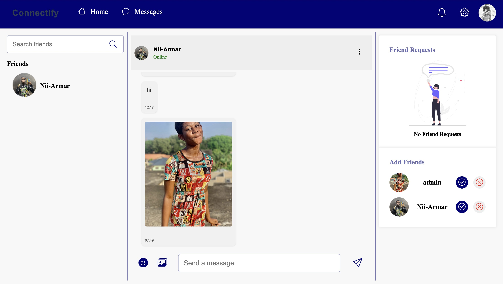
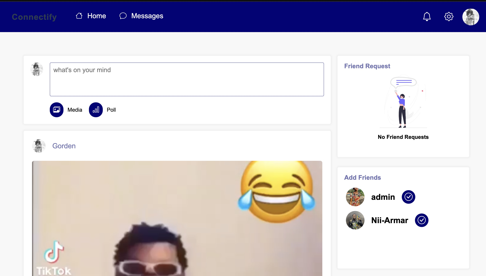

Here's a `README.md` formatted for your GitHub project, complete with sections and placeholders for your images.

---

# 🚀 **Connectify - A Social Media Platform**

### **"Connect. Share. Chat in Real Time."**

---

## 📖 **What is Connectify?**

Connectify is a dynamic social media platform where users can:

- Connect with friends.
- Share posts and media.
- Chat in real time.

**Purpose:** To create a space where users can build and maintain relationships through friend requests and communication.

---

## 🌟 **Core Features**

- **👤 User Profiles:** Personal details, photos, and updates.
- **🤝 Friend Requests:** Send and receive friend requests.
- **💬 Real-Time Chat:** Chat with friends after accepting requests.
- **📸 Post Sharing:** Share posts and media.
- **🔔 Notifications:** Alerts for friend requests, messages, and updates.

### 🔒 **Security**

- Secure authentication and privacy-focused features.

---

## 🛠️ **Technology Stack**

| **Layer**         | **Technologies**                     |
|-------------------|---------------------------------------|
| **Frontend**      | HTML5, CSS3, JavaScript              |
| **Backend**       | Django with Django Channels          |
| **Database**      | PostgreSQL / MongoDB                 |
| **Real-time**     | WebSockets with Django Channels      |

---

## 🏗️ **System Architecture**

### **Diagram Overview**

```
Users → Frontend → Backend (Django) → Database
```

- **Real-time Communication:** WebSockets via Django Channels.
- **Data Storage:** PostgreSQL or MongoDB.

**Key Components:**

- **Models:** User, FriendRequest, Post, Message.
- **WebSocket Consumers:** For real-time chat.

---

## 🔄 **User Workflow**

1. **Sign Up / Login**  
2. **Send / Accept Friend Requests**  
3. **Share Posts**  
4. **Chat in Real-Time**  

---

## 🖼️ **Features in Action**
### **Login Page**  


### **Profile Page** 



### **Chat Interface**  


### **Post Sharing**  


---

## 🚧 **Challenges and Solutions**

### **Challenges**

- Handling real-time interactions (friend requests, messaging).  
- Managing post-sharing privacy.  
- Ensuring secure authentication.

### **Solutions**

- **Real-time Communication:** Django Channels.  
- **User Workflows:** Clear interaction flows.  
- **Security:** Robust Django authentication.

---

## 🔮 **Future Enhancements**

- 🗨️ Group chats and chat rooms.  
- 🎨 Enhanced user profile customization.  
- 🚨 Content moderation and reporting.  
- ❤️ Post likes and follow features.

---

**Made with ❤️ by Gorden Archer**

